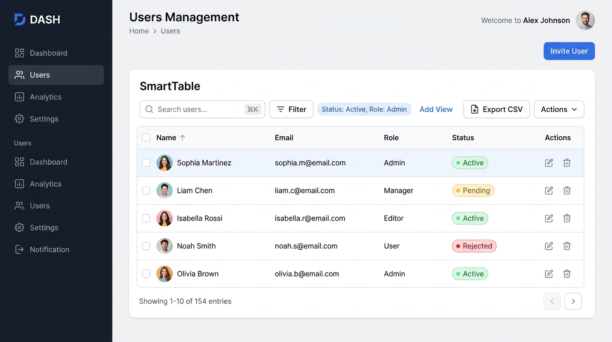
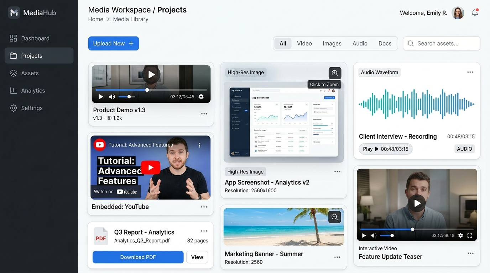
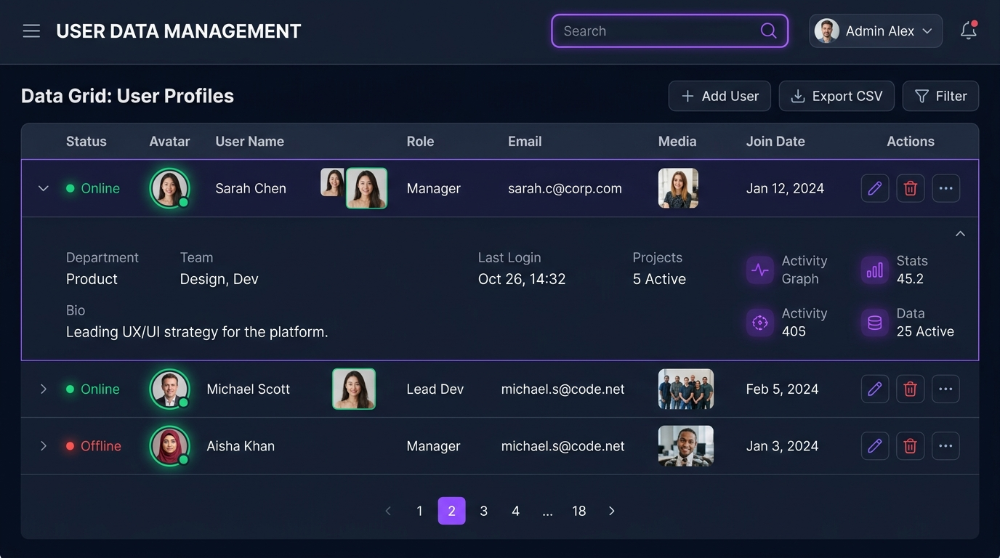

# smart-react-admin-components ⚡

> Lightweight, accessible, TypeScript-first React components designed for rapidly building high-performance admin dashboards, data grids, and rich media interfaces.

[](https://www.npmjs.com/package/smart-react-admin-components)
[](https://bundlephobia.com/package/smart-react-admin-components)
[](https://github.com/mrcoder4528-lang/smart-react-admin-components/blob/main/LICENSE)
[](https://www.typescriptlang.org/)
[](https://github.com/mrcoder4528-lang/smart-react-admin-components/actions)

---

## 📸 Screenshots & Showcase

### 1. SmartTable with Avatars, Badges, Search & CSV Export


### 2. Multi-Format Media Hub (Video, YouTube Iframe, Images with Lightbox, Audio, Docs)


### 3. Dark Mode Admin Data Grid with Avatar Groups & Row Drawers


---

## ✨ Features

- 🏎️ **Ultra-fast & Tree-Shakeable**: Dual ESM/CJS build with `"use client";` banner compatibility for Next.js App Router.
- 🎨 **Modern Design System**: Sleek aesthetics with built-in dark/light mode CSS tokens and zero runtime CSS overhead.
- ♿ **WAI-ARIA Compliant**: Accessible keyboard navigation, dialogs, status badges, and menus out of the box.
- 🖼️ **Multi-Type Media & Avatars**:
  - `SmartAvatar` & `SmartAvatarGroup`: Color-coded initials, online status dots, circular/rounded shapes, click-to-preview.
  - `SmartMedia`: Universal viewer for **Images** (with zoom lightbox), **HTML5 Video**, **Iframe/YouTube/Vimeo Embeds**, **Audio Player Pills**, and **Document Files**.
- 📦 **Comprehensive Admin Grid Toolkit**:
  - `SmartTable`: Sortable, searchable, selectable, paginated data grid with CSV export.
  - `SmartPagination`: Accessible page numbers, page size switcher, and item counts.
  - `SmartSearch`: Debounced input with keyboard shortcuts (`/` or `⌘K`) and clear button.
  - `SmartFilter`: Multi-category faceted filter popover with active filter tags.
  - `StatusBadge`: Semantic status pills with optional pulsing live activity indicators.
  - `ActionMenu`: Accessible dropdown for row-level and batch actions.
  - `ConfirmDialog`: Modal confirmation for dangerous or critical operations.
  - `EmptyState`: Visually balanced empty states with call-to-action support.
  - `exportCSV`: Universal client-side data exporter with quote-escaping and custom formatting.

---

## 📦 Installation

```bash
# npm
npm install smart-react-admin-components

# yarn
yarn add smart-react-admin-components

# pnpm
pnpm add smart-react-admin-components
```

### Import Styles

Import the CSS stylesheet once at the root of your application (e.g. `main.tsx`, `App.tsx`, or Next.js `layout.tsx`):

```tsx
import 'smart-react-admin-components/styles.css';
```

---

## 🚀 Quick Start

```tsx
import React from 'react';
import {
  SmartTable,
  SmartAvatar,
  SmartMedia,
  StatusBadge,
  ActionMenu,
  type SmartTableColumn,
} from 'smart-react-admin-components';
import 'smart-react-admin-components/styles.css';

interface User {
  id: number;
  name: string;
  avatarUrl?: string;
  email: string;
  role: string;
  mediaPreview?: string;
  status: 'active' | 'pending' | 'rejected';
}

const users: User[] = [
  {
    id: 1,
    name: 'Sophia Martinez',
    avatarUrl: 'https://images.unsplash.com/photo-1494790108377-be9c29b29330?w=100',
    email: 'sophia.m@email.com',
    role: 'Admin',
    mediaPreview: 'https://images.unsplash.com/photo-1460925895917-afdab827c52f?w=300',
    status: 'active',
  },
  {
    id: 2,
    name: 'Liam Chen',
    avatarUrl: 'https://images.unsplash.com/photo-1507003211169-0a1dd7228f2d?w=100',
    email: 'liam.c@email.com',
    role: 'Manager',
    mediaPreview: 'https://www.youtube.com/watch?v=dQw4w9WgXcQ',
    status: 'pending',
  },
  {
    id: 3,
    name: 'Noah Smith',
    email: 'noah.s@email.com',
    role: 'User',
    status: 'rejected',
  },
];

const columns: SmartTableColumn<User>[] = [
  {
    key: 'avatar',
    title: '',
    width: 60,
    render: (_, record) => (
      <SmartAvatar
        src={record.avatarUrl}
        name={record.name}
        size="sm"
        status={record.status === 'active' ? 'online' : undefined}
        preview
      />
    ),
  },
  { key: 'name', title: 'Name', dataIndex: 'name', sortable: true },
  { key: 'email', title: 'Email', dataIndex: 'email', sortable: true },
  { key: 'role', title: 'Role', dataIndex: 'role' },
  {
    key: 'media',
    title: 'Media',
    render: (_, record) =>
      record.mediaPreview ? (
        <SmartMedia
          src={record.mediaPreview}
          width={80}
          height={48}
          aspectRatio="16/9"
          preview
        />
      ) : (
        <span style={{ color: 'var(--sra-text-subtle)' }}>None</span>
      ),
  },
  {
    key: 'status',
    title: 'Status',
    render: (_, record) => (
      <StatusBadge status={record.status} pulse={record.status === 'active'} />
    ),
  },
  {
    key: 'actions',
    title: 'Actions',
    align: 'right',
    render: (_, record) => (
      <ActionMenu
        items={[
          { id: 'edit', label: 'Edit Profile', onClick: () => alert(`Edit ${record.name}`) },
          { id: 'del', label: 'Delete', variant: 'danger', onClick: () => alert(`Delete ${record.name}`) },
        ]}
      />
    ),
  },
];

export function UsersDashboard() {
  return (
    <div style={{ padding: '2rem' }}>
      <h1>Users Management</h1>
      <SmartTable
        data={users}
        columns={columns}
        rowKey="id"
        selectable
        searchable
        exportable
        exportFilename="users-export.csv"
        pageSize={10}
        onSelectChange={(keys, rows) => console.log('Selected:', keys, rows)}
      />
    </div>
  );
}
```

---

## 🛠️ Component API Reference

### `<SmartAvatar />` & `<SmartAvatarGroup />`
Displays user profile pictures with automatic initials fallback, online status indicators, and modal enlargement.

```tsx
// Single Avatar with Online Status
<SmartAvatar
  src="https://example.com/photo.jpg"
  name="Sarah Chen"
  size="md"
  status="online"
  preview
/>

// Initials Fallback (Generates unique color from name)
<SmartAvatar name="Alex Johnson" size="lg" />

// Stacked Avatar Group with Overflow Count (+3)
<SmartAvatarGroup max={3} size="md">
  <SmartAvatar name="Sarah Chen" src="/p1.jpg" />
  <SmartAvatar name="Liam Chen" src="/p2.jpg" />
  <SmartAvatar name="Isabella Rossi" src="/p3.jpg" />
  <SmartAvatar name="Noah Smith" />
  <SmartAvatar name="Olivia Brown" />
</SmartAvatarGroup>
```

| Prop | Type | Default | Description |
| :--- | :--- | :--- | :--- |
| `src` | `string` | `undefined` | Image URL |
| `name` | `string` | `undefined` | User name (used for color-coded initials on fallback) |
| `size` | `'xs' \| 'sm' \| 'md' \| 'lg' \| 'xl' \| number` | `'md'` | Avatar dimensions |
| `shape` | `'circle' \| 'rounded' \| 'square'` | `'circle'` | Shape outline |
| `status` | `'online' \| 'offline' \| 'busy' \| 'away'` | `undefined` | Indicator dot color |
| `preview` | `boolean` | `false` | Click opens enlarged profile photo modal |

---

### `<SmartMedia />`
Universal media component supporting **Images**, **Videos**, **YouTube/Vimeo Iframes**, **Audio Files**, and **Documents** with full-screen lightbox zoom.

```tsx
// 1. High-Resolution Image with Lightbox Zoom
<SmartMedia
  src="https://images.unsplash.com/photo-1"
  type="image"
  aspectRatio="16/9"
  preview
/>

// 2. Embedded YouTube or Vimeo Video Iframe
<SmartMedia
  src="https://www.youtube.com/watch?v=dQw4w9WgXcQ"
  type="iframe"
  aspectRatio="16/9"
/>

// 3. HTML5 Video Player
<SmartMedia
  src="/videos/demo.mp4"
  poster="/thumbnails/demo.jpg"
  type="video"
  controls
/>

// 4. Audio Player Pill
<SmartMedia
  src="/audio/interview.mp3"
  type="audio"
/>

// 5. Document / PDF Card
<SmartMedia
  src="/reports/q3-report.pdf"
  title="Q3 Analytics Report"
  fileSize="2.4 MB"
  type="file"
/>
```

| Prop | Type | Default | Description |
| :--- | :--- | :--- | :--- |
| `src` | `string` | **required** | URL or path to media asset |
| `type` | `'auto' \| 'image' \| 'video' \| 'iframe' \| 'audio' \| 'file'` | `'auto'` | Media type (auto-detects from extension/domain) |
| `aspectRatio` | `'16/9' \| '4/3' \| '1/1' \| '21/9' \| 'auto'` | `'auto'` | Aspect ratio lock |
| `preview` | `boolean` | `true` | Enables interactive full-screen lightbox on click |
| `controls` | `boolean` | `true` | Shows playback controls for video/audio |
| `poster` | `string` | `undefined` | Thumbnail image for video player |
| `badge` | `ReactNode` | `undefined` | Custom overlay badge (e.g. tag or duration) |

---

### `<SmartTable />`
The primary data grid component. Supports client-side or server-side workflows.

| Prop | Type | Default | Description |
| :--- | :--- | :--- | :--- |
| `data` | `T[]` | `[]` | Array of records to display |
| `columns` | `SmartTableColumn<T>[]` | `[]` | Column configurations |
| `rowKey` | `keyof T \| ((r: T) => string \| number)` | **required** | Unique identifier for rows |
| `selectable` | `boolean` | `false` | Enables row selection checkboxes and batch bar |
| `searchable` | `boolean` | `true` | Enables built-in search input |
| `paginated` | `boolean` | `true` | Enables pagination controls |
| `pageSize` | `number` | `10` | Rows per page |
| `loading` | `boolean` | `false` | Shows animated loading skeleton rows |
| `exportable` | `boolean` | `true` | Renders "Export CSV" button |
| `exportFilename` | `string` | `'table-data.csv'` | Filename for CSV downloads |
| `striped` | `boolean` | `false` | Alternating row background colors |
| `dense` | `boolean` | `false` | Compact cell padding |
| `stickyHeader` | `boolean` | `false` | Fixes header during vertical scroll |
| `serverSide` | `boolean` | `false` | Disables client sorting/filtering/paging for API control |
| `totalItems` | `number` | `undefined` | Total record count for server-side pagination |
| `batchActions` | `(keys, rows) => ReactNode` | `undefined` | Custom action buttons on selection |
| `renderExpandedRow` | `(record, index) => ReactNode` | `undefined` | Accordion row expansion |

---

### `<StatusBadge />`
Displays semantic status pills with automatic palette mapping.

| Prop | Type | Default | Description |
| :--- | :--- | :--- | :--- |
| `status` | `string` | **required** | Status text (e.g., `'active'`, `'pending'`, `'rejected'`, `'paid'`) |
| `variant` | `'success' \| 'warning' \| 'danger' \| 'info' \| 'neutral' \| 'primary'` | auto | Color variant override |
| `dot` | `boolean` | `true` | Shows indicator dot |
| `pulse` | `boolean` | `false` | Enables radiating pulse animation |
| `size` | `'sm' \| 'md' \| 'lg'` | `'md'` | Badge size |

---

### `<SmartSearch />`
Search input with debouncing, clear button, and keyboard shortcuts.

| Prop | Type | Default | Description |
| :--- | :--- | :--- | :--- |
| `value` | `string` | `undefined` | Controlled value |
| `onChange` | `(val: string) => void` | `undefined` | Instant input change callback |
| `onSearch` | `(val: string) => void` | `undefined` | Debounced search trigger |
| `debounceMs` | `number` | `0` | Debounce delay in milliseconds |
| `shortcutKey` | `string` | `'/'` | Global shortcut key (`'/'` or `'k'` for ⌘K) |

---

### `<ActionMenu />`
Accessible action dropdown for table rows or cards.

```tsx
<ActionMenu
  items={[
    { id: 'view', label: 'View Profile', onClick: () => {} },
    { id: 'edit', label: 'Edit Account', onClick: () => {} },
    { id: 'sep', label: '', divider: true, onClick: () => {} },
    { id: 'delete', label: 'Delete', variant: 'danger', onClick: () => {} },
  ]}
/>
```

---

### `<ConfirmDialog />`
Accessible confirmation modal dialog with async confirmation states.

```tsx
<ConfirmDialog
  isOpen={isModalOpen}
  title="Delete Project"
  message="Are you sure you want to delete this project? All associated resources will be permanently removed."
  variant="danger"
  confirmText="Delete"
  onClose={() => setModalOpen(false)}
  onConfirm={async () => {
    await deleteProject(id);
    setModalOpen(false);
  }}
/>
```

---

### `exportCSV(data, options)`
Utility function to export JavaScript objects to formatted CSV files.

```tsx
import { exportCSV } from 'smart-react-admin-components';

exportCSV(data, {
  filename: 'sales-report.csv',
  columns: [
    { key: 'orderId', label: 'Order ID' },
    { key: 'total', label: 'Total Amount', format: val => `$${val.toFixed(2)}` },
  ],
});
```

---

## 🎨 Theming & Customization

The design system uses standard CSS custom properties. You can customize the look and feel or switch to dark mode by setting attributes:

```html
<!-- Dark Mode -->
<body data-theme="dark">
  <!-- or <body class="dark"> -->
</body>
```

### Overriding CSS Variables

```css
:root {
  --sra-primary: #8b5cf6; /* Change accent to Purple */
  --sra-primary-hover: #7c3aed;
  --sra-radius-md: 10px; /* Custom rounded corners */
}
```

---

## 🏗️ Development & Publishing

### Build
```bash
npm run build
```

### Run Tests
```bash
npm test
```

### Versioning with Changesets
```bash
# Add a changeset for your changes
npx changeset

# Bump versions and generate changelog
npx changeset version

# Publish to npm
npm run release
```

---

## 📄 License

MIT © [Vijay](https://github.com/mrcoder4528-lang)
